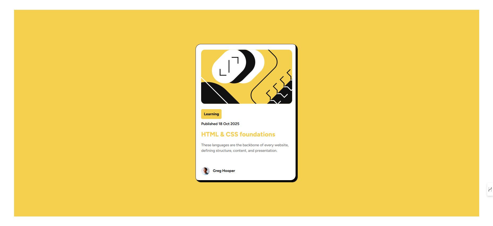

# 🎯 Sobre o Projeto

Um card de blog responsivo desenvolvido com HTML e CSS, seguindo um design moderno com efeitos interativos.

# 🖼️ Preview do Projeto



# ✨ Funcionalidades

- ✅ Design responsivo para todos os dispositivos
- ✅ Efeitos hover interativos
- ✅ Layout semântico e acessível
- ✅ Tipografia customizada
- ✅ Sombras e bordas estilizadas

# 🛠️ Tecnologias Utilizadas

- **HTML5** - Estrutura semântica
- **CSS3** - Estilização avançada
  - Flexbox
  - Media Queries
  - Custom Fonts
  - Variáveis CSS
  - Efeitos hover

# 🎨 Características do Design

- **Cores**:
  - Fundo amarelo: `hsl(47, 88%, 63%)`
  - Texto escuro: `hsl(0, 0%, 7%)`
  - Texto cinza: `hsl(0, 0%, 42%)`
- **Tipografia**: Figtree (Variable Font)
- **Layout**: Card centralizado com sombras

# 📱 Responsividade

O projeto é totalmente responsivo com breakpoints para:

- **Desktop**: 1200px+
- **Tablet**: 768px
- **Mobile**: 480px

# 🚀 Como Executar

```bash
# Clone o repositório
git clone https://github.com/RodrigoLima30/blog-preview-card.git

# Abra o arquivo index.html no navegador
# ou use uma extensão Live Server no VS Code
```
